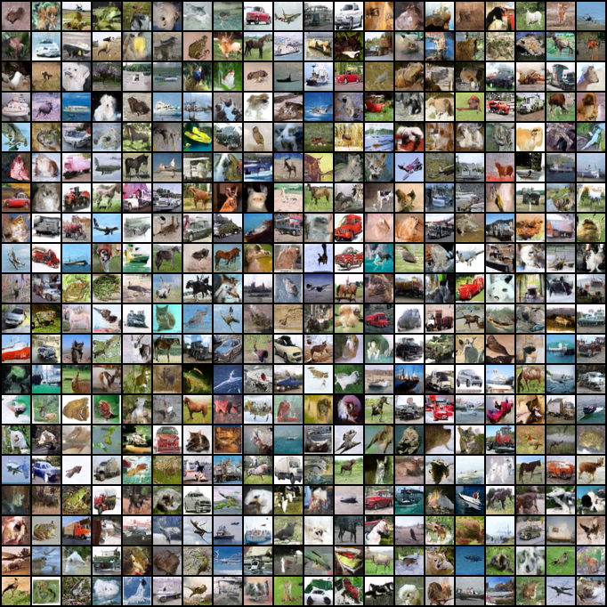
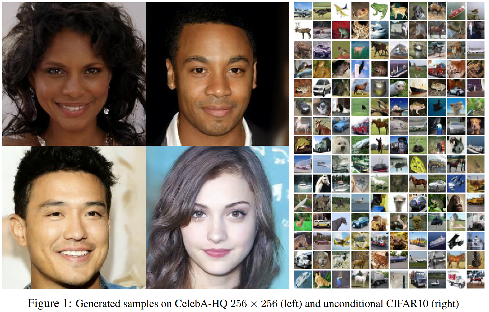

# PyTorch Implementation for DDPM
This is a PyTorch implementation for the [Denoising Diffusion Probabilistic Model](https://proceedings.neurips.cc/paper/2020/hash/4c5bcfec8584af0d967f1ab10179ca4b-Abstract.html). Based on the official [Tensorflow implementation](https://github.com/hojonathanho/diffusion), we implement DDPM in PyTorch, which is more readable than the official counterpart. Besides, this implementation supports multi-GPU training with the help of the `DistributedDataParallel` library. We put all the parameters into a configuration file and access them in code. So you can modify your settings as you like. The authors select the U-Net backbone for noise prediction and adjust it with time embeddings. All the default hyperparameter values are nearly the same as DDPM except that we don't use EMA in our training for simplicity.

**Note**: If our machine has multiple GPUs, we can specify which GPUs to use in the [config](./config.yaml) file.

Here are 400 generated samples on CIFAR10.

## Authors

Jonathan Ho, Ajay Jain, Pieter Abbeel

## Abstract

We present high-quality image synthesis results using diffusion probabilistic models, a class of latent variable models inspired by considerations from nonequilibrium thermodynamics. Our best results are obtained by training on a weighted variational bound designed according to a novel connection between diffusion probabilistic models and denoising score matching with Langevin dynamics, and our models naturally admit a progressive lossy decompression scheme that can be interpreted as a generalization of autoregressive decoding. On the unconditional CIFAR10 dataset, we obtain an Inception score of 9.46 and a state-of-the-art FID score of 3.17. On 256x256 LSUN, we obtain sample quality similar to ProgressiveGAN. Our implementation is available at https://github.com/hojonathanho/diffusion.

